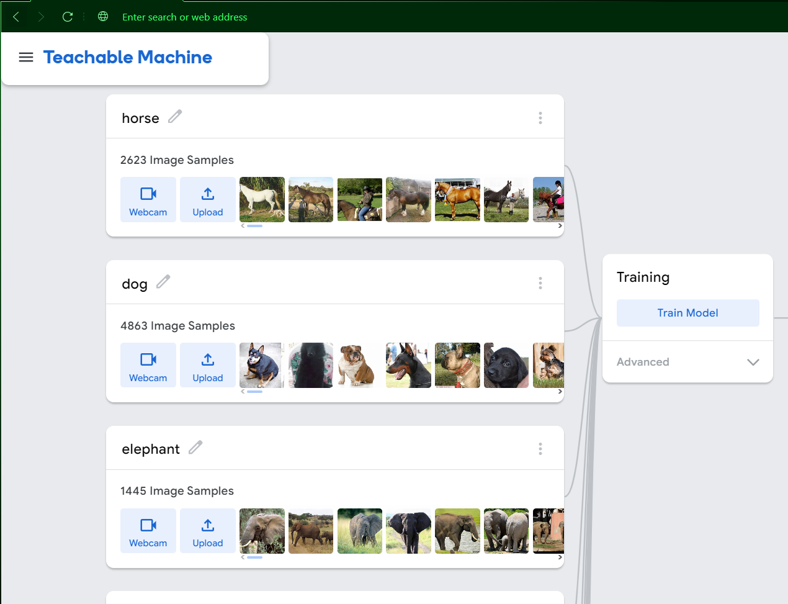
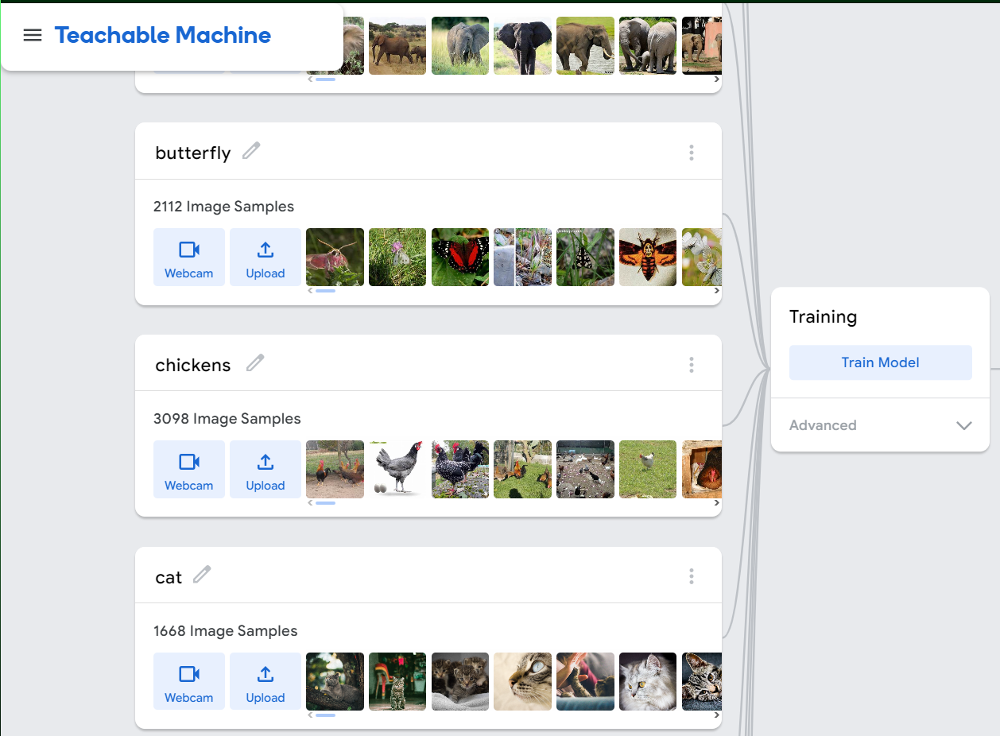
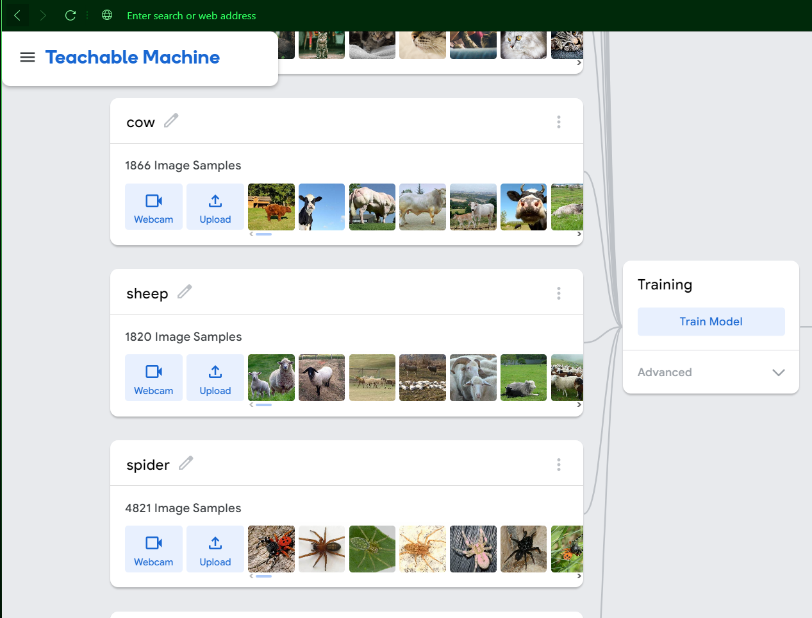
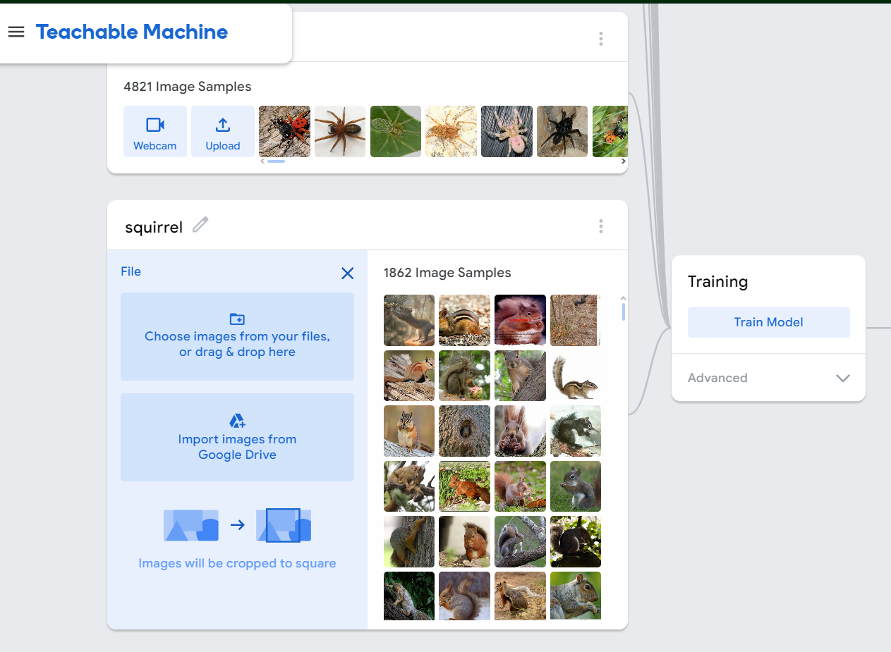
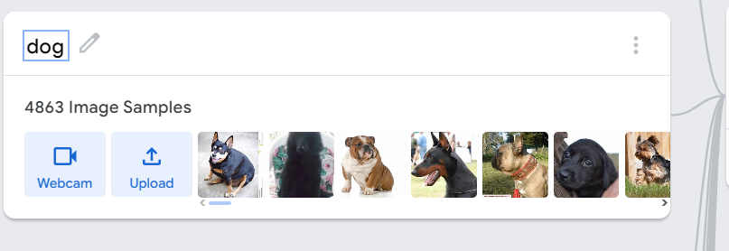
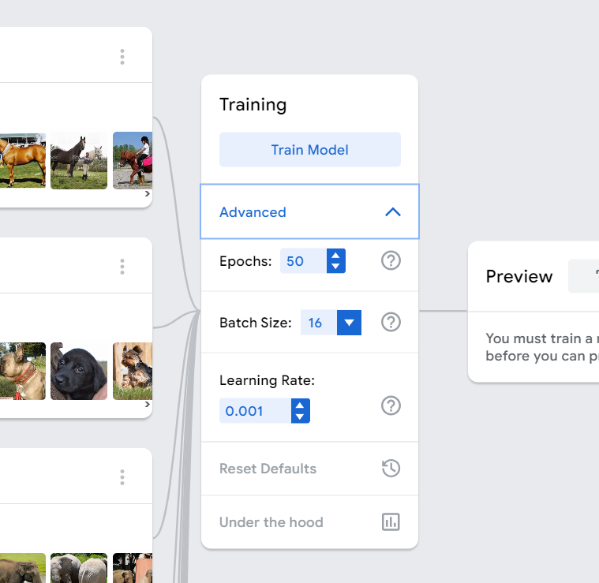
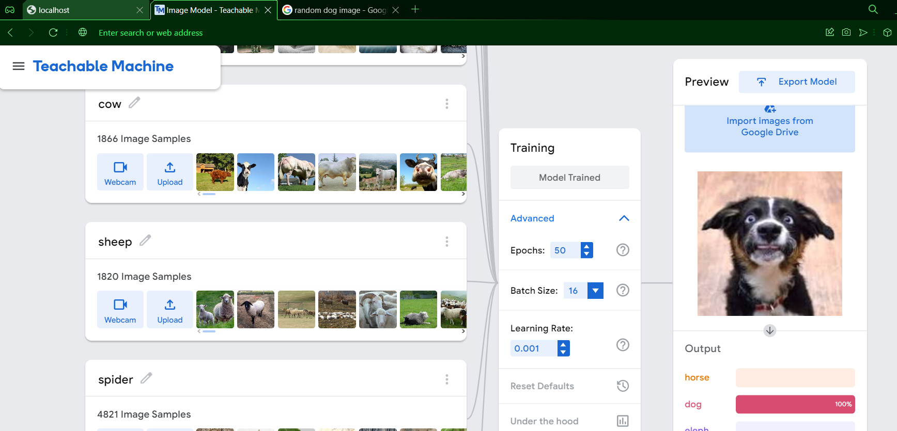
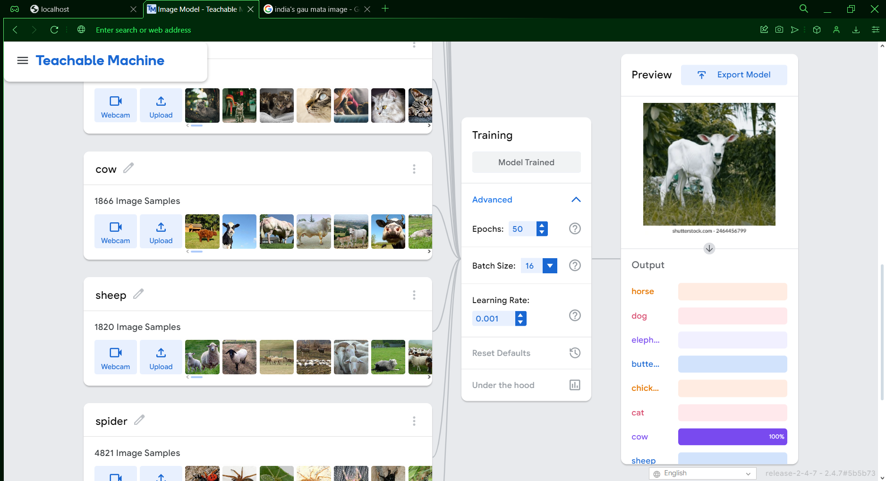
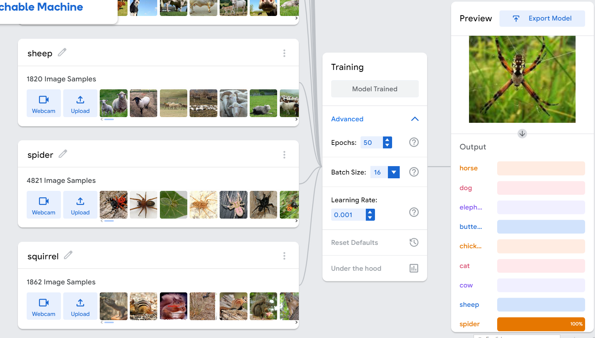
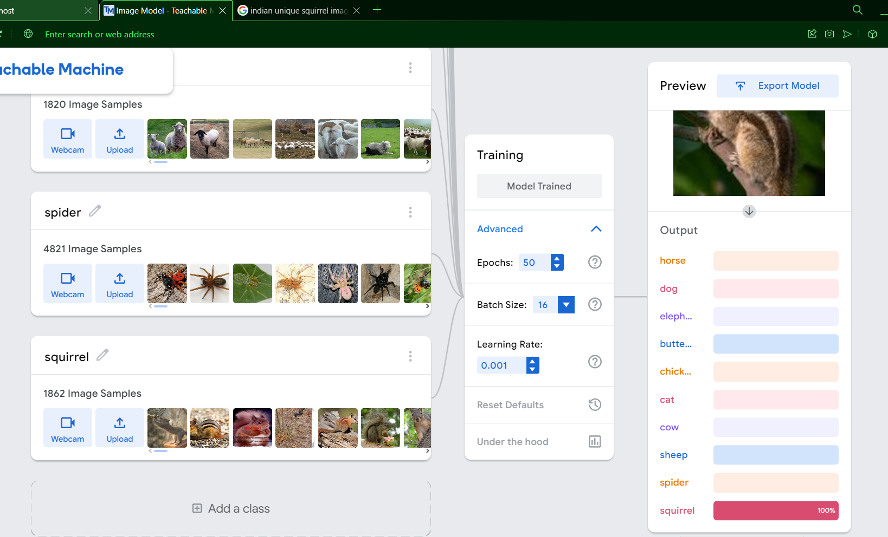

# Machine Learning Animal Classifier

This project aims to create a machine learning model using Google Teachable Machine to identify different animals. The model is trained on a dataset consisting of various animal images.

## Steps to Train the Model

1. **Gather the Animal Dataset**: Collect a diverse set of animal images to train the model. Ensure that the dataset contains images of different animal species.

2. **Preprocess the Images**: Before training the model, it is important to preprocess the images. This may involve resizing, cropping, or normalizing the images to ensure consistency.

3. **Create Training and Validation Sets**: Split the dataset into training and validation sets. The training set will be used to train the model, while the validation set will be used to evaluate its performance.
Website :- https://teachablemachine.withgoogle.com/train/image
4. **Upload the Dataset to Google Teachable Machine**: Use the Google Teachable Machine platform to upload the animal dataset. This platform provides an intuitive interface for training machine learning models without writing code.
I have used the below images set uploaded on the Google Teachable Machine To Train Model:-

5. **Define Classes and Labels**: Assign appropriate class labels to the different animal species in the dataset. This step is crucial for the model to learn and classify the animals accurately.

6. **Train the Model**: Start the training process in Google Teachable Machine. This step involves feeding the dataset to the model and allowing it to learn the patterns and features of the animals.

7. **Evaluate the Model**: After training, evaluate the performance of the model using the validation set. This step helps to assess the accuracy and effectiveness of the model in identifying different animals.

8. **Export the Model**: Once satisfied with the model's performance, export it from Google Teachable Machine. This will generate the necessary files to use the model in other applications or platforms.

9. **Testing the Model**: After training, test the performance of the model below:-

## Usage

To use the trained animal classifier model, follow these steps:

1. Install the necessary dependencies and libraries required to run the model.

2. Load the exported model files into your application or platform.

3. Provide an input image to the model and let it classify the animal species.

4. Retrieve the predicted class label and use it as desired in your application.

## Contributing

Contributions to this project are welcome. If you have any suggestions, bug reports, or feature requests, please open an issue or submit a pull request.

## License

This project made Aditya Kumar
